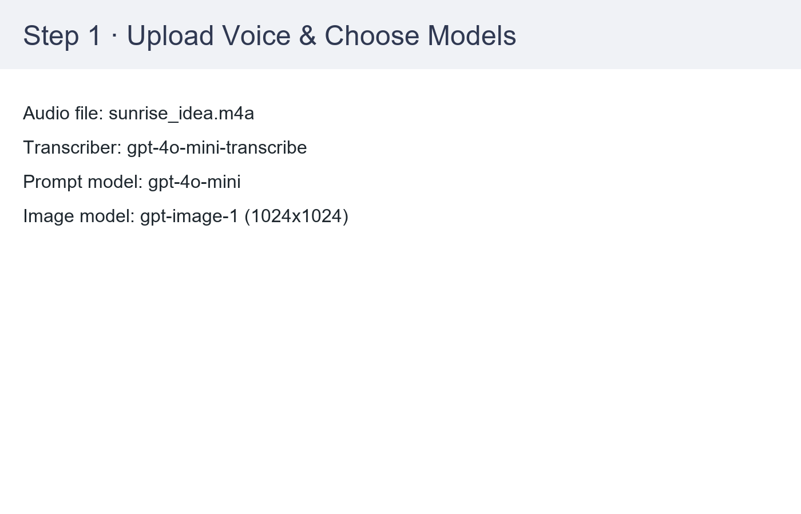
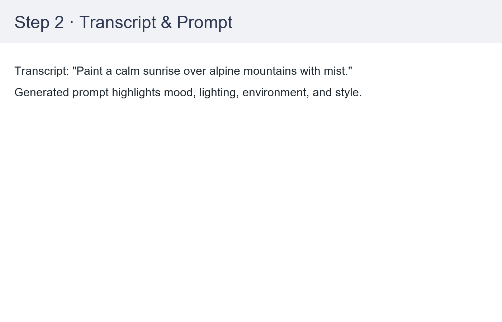

# Voice to Image Studio

Voice to Image Studio is a Streamlit-based agent that turns spoken ideas into visuals. A short voice memo is transcribed, rewritten into an image prompt by an LLM, rendered by an image generator, and all intermediate artifacts are surfaced in the UI and console logs.

## Features

- 🎙️ Audio ingestion: upload any short MP3/WAV/M4A/WEBM clip.
- ✍️ Automatic transcription and prompt authoring via OpenAI LLMs.
- 🖼️ Image generation using DALL-E 3 or DALL-E 2 with configurable output sizes.
- 📊 Transparent workflow: transcript, prompt, model selections, and artwork are displayed side by side.
- 🧾 Console logging for every stage (audio receipt, transcription, prompt crafting, image rendering).

## Requirements

- Python 3.11+
- OpenAI account with access to:
  - `whisper-1` (for transcription)
  - `gpt-4o-mini` or similar (for prompt generation)
  - `dall-e-3` or `dall-e-2` (for image generation)
- `OPENAI_API_KEY` exported or placed inside a `.env` file

## Setup

```bash
# 1. Optional: create a virtual environment
python -m venv .venv
.\\.venv\\Scripts\\activate

# 2. Install dependencies
pip install -r requirements.txt

# 3. Provide your API key
echo OPENAI_API_KEY=sk-... > .env
```

## Running the App

```bash
streamlit run streamlit_app.py
```

Keep the terminal visible—the agent prints informative logs for each stage so you can trace the workflow end to end.

## End-to-End Workflow (Real Example)

1. **Upload & configure** – load a `sunrise_idea.m4a` memo and select the models/sizes.



2. **Transcript & prompt** – the agent shows the exact transcript and the synthesized image prompt before generation.



3. **Generated artwork** – the rendered image appears with download controls and a list of models used.


## How It Works

1. **Transcription** – `whisper-1` converts speech to text and logs the transcript.
2. **Prompt crafting** – `gpt-4o-mini` rewrites the transcript into a descriptive prompt (lighting, mood, subjects).
3. **Image rendering** – `dall-e-3` or `dall-e-2` produces a PNG (default `1024x1024`), which is displayed and downloadable.
4. **Observability** – all steps emit structured logs so you can debug slowdowns or prompt issues quickly.

## Deployment to Streamlit Cloud

### Step 1: Push to GitHub
Make sure your code is in a GitHub repository (already done if you're reading this from the repo).

### Step 2: Deploy to Streamlit Cloud
1. Go to [share.streamlit.io](https://share.streamlit.io)
2. Sign in with your GitHub account
3. Click **"New app"**
4. Select your repository: `rahbarnisa/CapstoneProject2`
5. Set **Main file path**: `streamlit_app.py`
6. Click **"Deploy"**

### Step 3: Add Secrets (IMPORTANT!)
1. Once your app is deployed, click the **⋮** (three dots) menu in the top right
2. Select **"Settings"**
3. Click on **"Secrets"** tab
4. Add your OpenAI API key in TOML format:

```toml
OPENAI_API_KEY = "sk-your-actual-api-key-here"
```

5. Click **"Save"** — your app will automatically redeploy with the secrets

### Security Notes
- ✅ Secrets are encrypted and only accessible to your app
- ✅ Never commit `.env` files or API keys to your repository
- ✅ The `.gitignore` file protects against accidental commits
- ✅ Secrets are different from environment variables (they're Streamlit-specific)

## Customisation Ideas

- Allow multiple variations per request or seed locking for reproducibility.
- Persist history (audio + transcript + prompt + image) in a vector store or blob storage.
- Add a microphone recorder (e.g., `streamlit-webrtc`) for direct capture instead of file uploads.

## Troubleshooting

- **`OPENAI_API_KEY` missing** – the UI will stop and ask for the key. Ensure `.env` is in the project root or export the variable.
- **Audio parsing errors** – stick to short clips (<60s) and supported formats. Convert unusual codecs to WAV first.
- **Quota or permission errors** – double-check you have access to transcription, text, and image endpoints and enough credits.

Enjoy turning your voice sketches into visuals! 🎨
